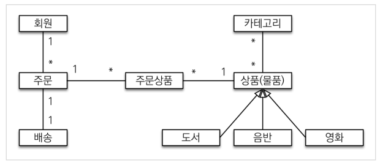
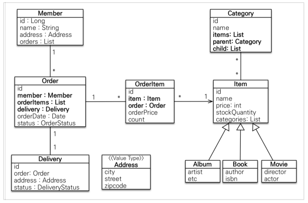
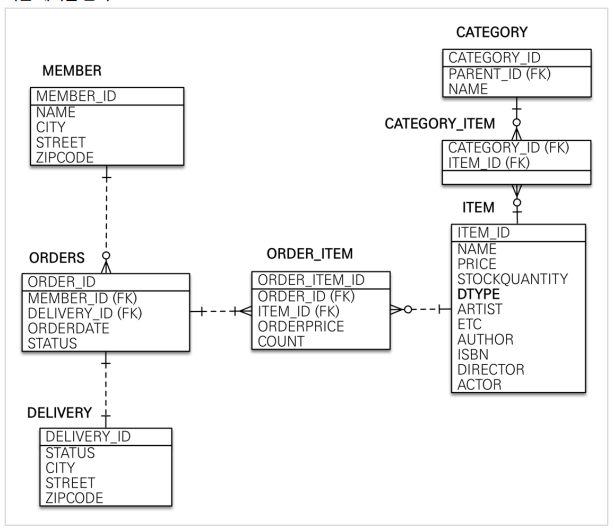

# :book: Week1

<br>

:bookmark_tabs: **목차**

- [프로젝트 환경설정](#프로젝트-환경설정)
- [도메인 분석 설계](#도메인-분석-설계)
- [애플리케이션 구현 준비](#애플리케이션-구현-준비)
- [회원 도메인 개발](#회원-도메인-개발)

<br>

### 프로젝트 환경설정

#### 프로젝트 생성

H2 데이터베이스 인메모리DB 를 활용한 편리한 환경 세팅

<br>

#### 라이브러리 살펴보기

- intellij 우측 gradle 탭 참조

- Gradle 의존 관계 살펴보기

```
./gradlew dependencies
./gradlew dependencies —configuration compileClasspath
```

<br>

```
spring-boot-starter-web
- spring-boot-starter-tomcat: 톰캣 (웹서버)
- spring-webmvc: 스프링 웹 MVC

spring-boot-starter-thymeleaf: 타임리프 템플릿 엔진(View)

spring-boot-starter-data-jpa
- spring-boot-starter-aop
- spring-boot-starter-jdbc
	- HikariCP 커넥션 풀 (부트 2.0 기본)
- hibernate + JPA: 하이버네이트 + JPA
- spring-data-jpa: 스프링 데이터 JPA

spring-boot-starter(공통): 스프링 부트 + 스프링 코어 + 로깅
- spring-boot
	- spring-core
- spring-boot-starter-logging

spring-boot-starter-test
- junit: 테스트 프레임워크
- mockito: 목 라이브러리
- assertj: 테스트 코드를 좀 더 편하게 작성하게 도와주는 라이브러리
- spring-test: 스프링 통합 테스트 지원

```

<br>

##### 로깅

스프링 부트는 모든 내부 로깅에 [Commons Logging](https://commons.apache.org/proper/commons-logging/)을 사용, 로그 구현체는 선택 가능하고, [Java Util Logging](https://docs.oracle.com/javase/8/docs/api/java/util/logging/package-summary.html), [Log4j2](	https://logging.apache.org/log4j/2.x/), [Logback](https://logback.qos.ch/) 을 위한 디폴트 설정 제공

스타터를 사용할 경우 기본적으로 로그백으로 로깅한다.

스프링 데이터 JPA는 스프링과 JPA를 먼저 이해하고 사용해야 하는 응용기술이다.

<br>

#### View 환경 설정

JPA 를 학습하는 것이 목적이기때문에 타임리프 활용은 제외

<br>

#### H2 데이터베이스 설치

##### H2 Database 특징

- 임베디드, 서버 모드 지원 (디스크 기반 또는 인메모리 데이터베이스)
- 트랜잭션 지원
- 브라우저 기반 콘솔앱 지원
- 경량의 파일 사이즈
- Embedded and server modes; disk-based or in-memory

로컬 개발 환경 구성에 적합한DB, 다음의 [H2 Cheat Sheet](https://www.h2database.com/html/cheatSheet.html) 참고

<br>

#### JPA와 DB 설정, 동작확인

```
spring:
 datasource:
 	url: jdbc:h2:tcp://localhost/~/jpashop
 	username: sa
 	password:
 	driver-class-name: org.h2.Driver
 jpa:
 	hibernate:
 		ddl-auto: create
 	properties:
# show_sql: true
 format_sql: true

 
logging.level:
 org.hibernate.SQL: debug
# org.hibernate.type: trace

 참고: 모든 로그 출력은 가급적 로거를 통해 남겨야 한다.
> show_sql : 옵션은 System.out 에 하이버네이트 실행 SQL을 남긴다.
> org.hibernate.SQL : 옵션은 logger를 통해 하이버네이트 실행 SQL을 남긴다.
```

<br>

```
url: jdbc:h2:tcp://localhost/~/jpashop;MVCC=TRUE

MVCC 옵션에 대한 참고
Multi-Version Concurrency Control (MVCC)
Insert and update operations only issue a shared lock on the table. An exclusive lock is still used when adding or removing columns or when dropping the table. Connections only 'see' committed data, and own changes. That means, if connection A updates a row but doesn't commit this change yet, connection B will see the old value. Only when the change is committed, the new value is visible by other connections (read committed). If multiple connections concurrently try to lock or update the same row, the database waits until it can apply the change, but at most until the lock timeout expires.

H2 1.4.200 버전부터 MVCC 옵션 제거 됨
다음의 링크 참고
https://github.com/h2database/h2database/releases/tag/version-1.4.200

Alternative MVStore database

*.h2.db is a PageStore database. *.mv.db is a MVStore database.
```

<br>

- 하이버네이트에 관한 옵션은 공식문서 참고
  - [Hibernate 문서](https://docs.jboss.org/hibernate/stable/orm/userguide/html_single/Hibernate_User_Guide.html)
  - org.hibernate.cfg.Environment 클래스 주석 참고
- 스프링 부트 관련 Environment 구성 요소는 공식 문서 참고
  - [스프링 부트 공식 문서]()

<br>

##### 레이어별 테스트 코드 

https://github.com/HomoEfficio/dev-tips/blob/master/Spring-Boot-%EB%A0%88%EC%9D%B4%EC%96%B4%EB%B3%84-%ED%85%8C%EC%8A%A4%ED%8A%B8.md

- 엔티티 매니저를 통할 경우 트랜잭션 안에서 이뤄져야함

```
./gradle clean build
```

스프링부트를 통해 복잡한 설정 자동화, 순수 스프링 JPA 설정시 사용하던 persitence.xml , LocalContainerEntityManagerFactoryBean 도 없다.

<br>

##### 쿼리 파라미터 남기기

- org.hibernate.type: trace 옵션 주기
- 외부 라이브러리 사용
  - [스프링 데이터 소스 데코레이터](https://github.com/gavlyukovskiy/spring-boot-data-source-decorator)
  - [https://jessyt.tistory.com/27](https://jessyt.tistory.com/27)

<br>

### 도메인 분석 설계

#### 요구사항 분석

**기능 목록**

- 회원 기능
  - 회원 등록 
  - 회원 조회 
- 상품 기능 
  - 상품 등록 
  - 상품 수정 
  - 상품 조회 
- 주문 기능 
  - 상품 주문 
  - 주문 내역 조회 
  - 주문 취소 
- 기타 요구사항 
  - 상품은 재고 관리가 필요하다. 
  - 상품의 종류는 도서, 음반, 영화가 있다. 
  - 상품을 카테고리로 구분할 수 있다.
  - 상품 주문시 배송 정보를 입력할 수 있다.

<br>

#### 도메인 모델과 테이블 설계



애플리케이션 요구사항에 맞춰 `도메인 모델`을 먼저 추출한 `다음 테이블 설계( 엔티티와 테이블간의 연관관계 매핑)`

<br>



<br>



> DB 테이블명, 컬럼명 결정 
>
> 관례에 맞춰 Naming Strategy 선택

<br>

##### 연관 관계 주인

```
연관 관계의 주인은 외래 키를 관리의 주체를 결정하는 일

일대다 관계에서 다쪽에 위치하는 것이 관리상 편함
```

<br>

#### 엔티티 클래스 개발

각 엔티티 클래스에 무분별하게 Getter, Setter 를 열 경우 관리 추적이 힘드므로 `비지니스에 따라 의미있는 메서드`를 사용하여 관리포인트를 줄이는 편이 좋음

- 실무에서는 @ManyToMany 사용 X
  - 1:N , N:1 관계로 풀어야함
- 모든 연관관계는 지연로딩 설정
  - 즉시로딩은 지양, JPQL 실행시 N+1 문제
  - 연관관계 모두 지연로딩으로 설정
  - fetch join 또는 엔티티 그래프 기능 사용
  - @XToOne 직접 지연로딩 설정
- 컬렉션은 필드에서 초기화
  - null safety
  - 하이버네이트가 제공하는  내장 컬렉션 변환시 위험

<br>

### 애플리케이션 구현 준비

- 계층형 구조 3tier
  - controller, web: 웹 계층 
  - service: 비즈니스 로직, 트랜잭션 처리 
  - repository: JPA를 직접 사용하는 계층, 엔티티 매니저 사용 
  - domain: 엔티티가 모여 있는 계층, 모든 계층에서 사용

<br>

### 회원 도메인 개발

##### 사용된 어노테이션 설명

- @Repository : 스프링 빈으로 등록, JPA 예외를 스프링 기반 예외로 예외 변환 
- @PersistenceContext : 엔티티 메니저( EntityManager ) 주입 
- @PersistenceUnit : 엔티티 메니터 팩토리( EntityManagerFactory ) 주입

- @Service 
- @Transactional : 트랜잭션, 영속성 컨텍스트 readOnly=true : 데이터의 변경이 없는 읽기 전용 메서드에 사용, 영속성 컨텍스트를 플러시 하지 않 으므로 약간의 성능 향상(읽기 전용에는 다 적용) 데이터베이스 드라이버가 지원하면 DB에서 성능 향상 
- @Autowired 생성자 Injection 많이 사용, 생성자가 하나면 생략 가능

- 생성자 주입 방식을 권장 변경 불가능한 안전한 객체 생성 가능 
- 생성자가 하나면, @Autowired 를 생략할 수 있다. 
- final 키워드를 추가하면 컴파일 시점에 memberRepository 를 설정하지 않는 오류를 체크할 수 있다. (보통 기본 생성자를 추가할 때 발견)

- @RunWith(SpringRunner.class) : 스프링과 테스트 통합 

- @SpringBootTest : 스프링 부트 띄우고 테스트(이게 없으면 @Autowired 다 실패) 

- @Transactional : 반복 가능한 테스트 지원, 각각의 테스트를 실행할 때마다 트랜잭션을 시작하고 테스트 가 끝나면 트랜잭션을 강제로 롤백 (이 어노테이션이 테스트 케이스에서 사용될 때만 롤백) 기능 설명 

  

  ```
  참고: 테스트 케이스 작성 고수 되는 마법: Given, When, Then (http://martinfowler.com/bliki/GivenWhenThen.html)
  이 방법이 필수는 아니지만 이 방법을 기본으로 해서 다양하게 응용하는 것을 권장한다
```
  
  