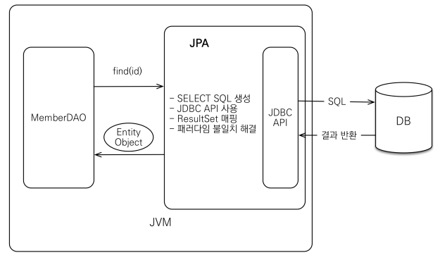
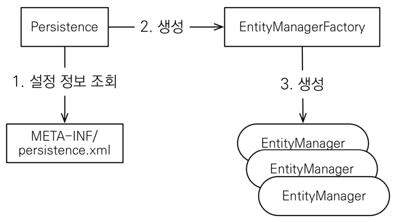
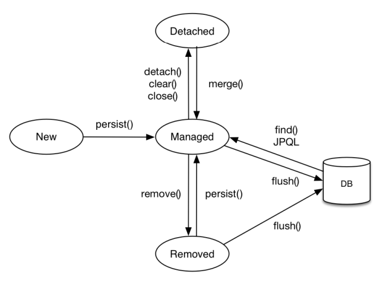
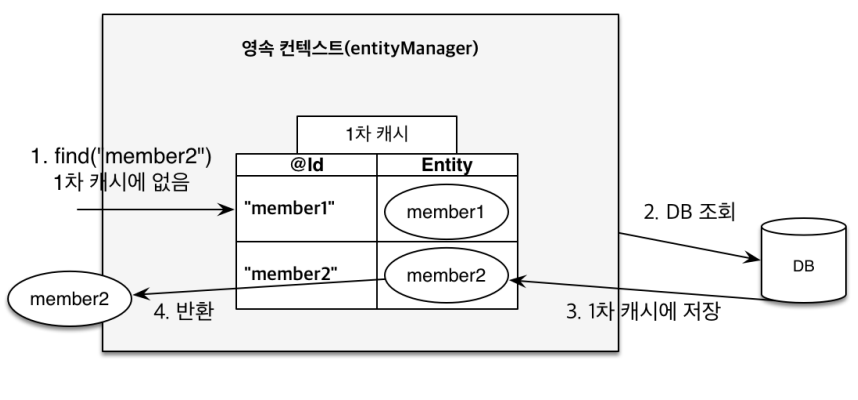

# JPA

> 김영한 JPA 로드맵 정주행 요약

목차

- [JPA 소개](#JPA-소개)
- [JPA 시작](#JPA-시작)
- [영속성 관리](#영속성-관리)

## JPA 소개

### SQL 중심적인 개발의 문제점

- 반복적인 CRUD
- SQL 에 의존적인 개발
  - SQL 문자열, 타입으로 제어 불가 -> 컴파일 시점 확인 불가, 잦은 오류
  - DAO , SQL 확인 필요 -> 계층 분할 X

`JPA 로 문제 해결`

 

### 패러다임 불일치

> 애플리케이션 복잡도가 올라가면서 이를 해결위한 장치들 존재
>
> ex) OOP -> 캡슐,정보은닉,다형성,상속

- 상속
- 연관관계
  - 참조 vs 외래키
- 객체 그래프 탐색
  - 지연로딩
- 동일성, 동등성

 

### JPA 란?

`Java Persistence API` 자바 진영의 ORM 기술 표준 -  JPA 는 애플리케이션과 JDBC 사이에서 동작

> JPA는 자바 ORM 기술에 대한 API 표준 명세

[JPA 명세](https://www.oracle.com/java/technologies/persistence-jsp.html)

 

**ORM**

- 객체 관계 매핑
- 객체와 관계형 DB 모델들을 ORM 프레임워크가 중간에서 매핑

 

#### WHY JPA?

- 생산성
- 유지보수
- 패러다임 불일치 해결
- 성능
- 데이터 접근 추상화와 벤더 독립성

 

## JPA 시작

### 설정

- JPA 표준 속성
- 하이버네이트 속성

 

#### 엔티티 매니저 설정

- 엔티티 매니저 팩토리
  - 생성 비용, 공유 사용
- 엔티티 매니저
  - DB커넥션, 스레드간 공유 재사용 X

 

데이터베이스 방언

- JPA 는 특정 데이터베이스에 종속 X
- 각각의 데이터베이스가 제공하는 SQL 문법과 함수는 조금씩 다름
  - 가변문자 MySQL VARCHAR Oracle VARCHAR2
  - 문자열 자르는 함수: SQL 표준 SUBSTRING(), Oracle SUBSTR()
  - 페이징: MySQL LIMIT, Oracle ROWNUM

## 영속성 관리

### 엔티티 매니저 팩토리와 엔티티 매니저

- 엔티티 매니저 팩토리는 한개만 만들어서 애플리케이션 전체 공유
  - 스레드세이프
- 엔티티 매니저는 스레드간 공유 X

### 영속성 컨텍스트란?

`엔티티를 영구 저장하는 환경`

- 엔티티를 영구 저장하는 환경
- 논리적인 개념
- 엔티티 매니저를 통해서 영속성 컨텍스트에 접근

 

### 엔티티의 생명주기

- 비영속
- 영속
- 준영속
- 삭제

### 영속성 컨텍스트의 특징

- 영속 상태는 식별자 값이 반드시 있어야 함
- 플러시
- 장점
  - 1차캐시
  - 동일성 보장
  - 트랜잭션을 지원하는 쓰기 지연
  - 변경 감지
  - 지연 로딩

`영속성 컨텍스트는 성능상 이점과 엔티티의 동일성을 보장`, `어플리케이션 차원에서 1차 캐시를 통해 REPEATABLE READ 트랜잭션 격리 수준 제공`

####  @DynamicUpade @Dynamic Insert

###  플러시

> 플러시는 영속성 컨텍스트의 변경내용을 DB에 반영

- em.flush() 직접 호출
- 트랜잭션 커밋시
- JPQL 쿼리

### 정리

- 객체와 관계형 데이터베이스 매핑하기
- 영속성 컨텍스트
  - 이점
- 엔티티 라이프 사이클

## 엔티티 매핑

### @Entity

- 기본 생성자 필수 (PUBLIC, PROTECTED)
- final. inner, interface class, enum 불가
- final field 불가

### @Table

### DB 스키마 자동 생성

> 연관 관계 확인 - 생성된 DDL 참고 `운영` 환경에서 지양

### 기본키 매핑

- 직접 할당
- 자동 생성
  - IDENTITY
  - SEQUENCE
  - TABLE

> :bulb: 권장하는 식별자 전략
>
> - 자연키 ex) 비지니스상 의미있는키
> - 대리키 ex) auto_increment, 시퀀스
>
> `대리키 `을 권장 -> 비지니스 환경 변함, 관리 일관성

#### 객체와 테이블 매핑

@Entity, @Table

@Entity 가 붙은 클래스 JPA 관리하는 대상, 엔티티라 한다.

- 주의
  - 기본 생성자 ( public or protected )
  - final 클래스, enum, interface, ineer 클래스 사용 X
  - 저장할 필드에 final 사용 X
- 리플렉션 통한 다양한 기법때문에 제한이 있음

#### 데이터베이스 스키마 자동 생성

- DDL을 애플리케이션 실행 시점에 자동 생성
- 테이블 중심 -> 객체 중심
- DB 방언을 활용해 DB 에 맞는 적절한 DDL 생성
- 생성된 DDL 은 개발환경에서만 사용
- 운영에서는 적용 X, 따로 작성하거나 적절히 다듬은 후 사용

연관관계 공부할떄 테이블 DDL 확인하는 용도로만 사용하는게 좋을듯

프로덕션DB, 개발DB에서도 절대 사용하지 말고, 로컬 개발 환경에서됴

DB 형상관리 툴을 이용해 변경사항 반영하는게 편리할듯

 

#### 필드와 컬럼 매핑

#####  @Column 옵션

- unique DDL 생성기능, 런타임 영향 X

각 옵션들에 대해서 정리해야 하나?

DDL 생성 관련 옵션은 필요없고 런타임에 영향 끼치는것만 사용 및 정리하자

##### @Enumerated

- 순서 or 이름 데이터베이스에 저장

##### @Temporal

LocalDate, LocalDateTime 지원으로 불필요

#### 기본 키 매핑 

##### @Id

- 직접할당
- 자동 생성 @GeneratedValue : 기본키 생성을 DB에 위임
  - IDENTITY
  - AUTO: DB방언에 따라 자동 설정
  - SEQUENCE
    - SEQUENCE GENARATOR 활용
    - TABLE 전략 : 키 생성 전용 테이블 만들어 시퀀스 흉내내는 전략

권장하는 식별자 전략

- 기본 키 제약 조건: not null, unique, 변하면 안됨
- 미래까지 이 조건 만족하는 자연키 찾기 힘듬, 대리키를 사용하자.
- ex) 주민번호 적절하지 않음
- 권장: Long형 + 대체키 + 키 생성전략 사용

IDENTITY 전략 

- 기본키 생성을 DB에 위임
- 주로 MySQL, PostgreSQL, SQL Server, DB2에서 사용
- MySQL의 AUTO_INCREMENT
- JPA 는 트랜잭션 커밋 시점에 INSERT SQL 실행
- AUTO_INCREMENT는 INSERT 후에 값을 알수 있음
- IDENTITY 전략은 em.persist() 시점에 즉시 INSERT SQL 실행 DB 식별자 조회
  - 쓰기 지연 전략 무의미..?
  - 버퍼링 해서 쓰기 전략 크게 성능에 영향 없다..?

시퀀스 전략 VS IDENTITY 전략 차이 비교하기

#### 요구사항 분석과 기본 매핑

JPA 어노테이션의 옵션중 DDL 시에 적용되는 사항 제약조건들을 사용하지 않더라도 엔티티만 보고 파악할 수 있도록 기록하는것도 좋다.

스프링 부트 설정에서 엔티티 필드를 컬럼 네임으로 변경하는 컨벤션 설정 찾아보기

##### 데이터 중심 설계의 문제점

- 객체 설계를 테이블 설계에 맞춘 방식
- 테이블의 외래키를 객체으 그대로 가져옴
- 객체 그래드 탐색이 불가능
- 참조가 없으므로 UML 잘못됨

